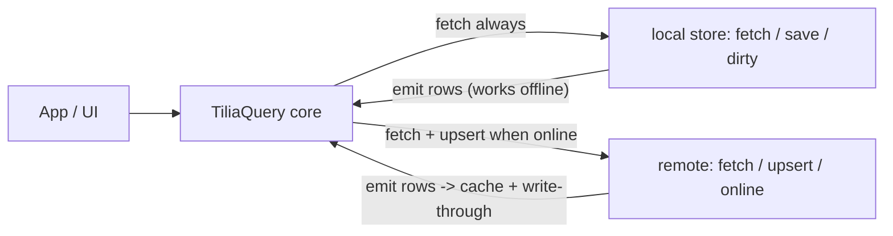

# @tilia/query

Offline-first query and cache layer for [Tilia](https://tiliajs.com) apps.

`@tilia/query` keeps a reactive in-memory view of your collections, backed by
two pluggable tiers: a **local store** (e.g. IndexedDB/Dexie) that answers
every query — even offline — and a **remote** (e.g. Supabase, REST, websocket)
that is the source of truth when the network is available. Writes are
optimistic, saved locally as a durable outbox, and replayed automatically on
reconnect — including after an app restart.

> Status: the API is stabilizing but the package is not yet published. Plain
> TypeScript types are on the roadmap; the source contract lives in
> [`src/TiliaQuery.resi`](src/TiliaQuery.resi).

## What it does

- shared object cache by id, query results as ids (normalized, consistent across views)
- `Loading` / `Loaded` / `NotFound` states per query
- offline-first reads: local store answers immediately, remote refreshes when online
- optimistic writes with a durable dirty outbox and automatic replay on reconnect
- boot replay: unsynced writes from a previous session resume syncing
- stale refresh in the background without clearing current data
- idle-query garbage collection driven by real reactivity (who is watching what)
- object-driven invalidation: a changed object marks matching queries stale

## What it does not do

- transport (HTTP, websocket, auth) — you provide a `remote` adapter
- storage (IndexedDB schemas, query glue) — you provide a `local` store adapter
- scheduling — you call `tick()` from your own timer
- domain APIs — wrap it with feature-shaped helpers

## How it works



Every query runs against the local store first (instant, works offline). When
online, the same query also runs against the remote; remote rows land last,
are written through to the local store, and refresh the query's freshness.
Rows with a pending write keep their optimistic value until the write settles.

## Quick start (ReScript)

```rescript
type todo = {id: string, title: string, done: bool}
type todoQuery = {done: bool}

let todos = TiliaQuery.make(
  ~id=todo => todo.id,
  ~remote,                      // remote adapter (see below)
  ~local,                       // local store adapter (optional)
  ~invalidates=(query, todo) => query.done == todo.done,
  (),
)

// Read (reactive, safe to call in render / observe / watch)
switch todos.array({done: false}) {
| Loading => renderSpinner()
| Loaded(rows) => renderList(rows)
| NotFound => renderEmpty()
}

// Write: optimistic, saved dirty locally, pushed when online
todos.upsert({id: "t1", title: "Ship it", done: false})

// Inbound updates (websocket / delta sync): cache + invalidation, no remote push
todos.sync(changedTodo)

// Call on your own schedule: stale refresh + garbage collection
todos.tick()
```

## The adapter contracts

Both adapters speak through the same channel type. A channel can emit several
times (cached rows now, fresh rows later, live updates forever) and becomes
inert once cancelled — late callbacks are ignored by the core.

```rescript
module Channel = {
  type state = Live | Cancelled
  type t<'a, 'issue> = {
    state: state,
    emit: 'a => unit,
    fail: 'issue => unit,
  }
}
```

### Remote

```rescript
type remote<'a, 'query> = {
  online: bool,
  fetch: ('query, Channel.t<array<'a>, string>) => option<unit => unit>,
  upsert: ('a, Channel.t<'a, upsertIssue<'a>>) => unit,
}

type upsertIssue<'a> =
  | Offline          // transient: the write stays queued and dirty
  | Conflict('a)     // server wins: server object is resolved into cache and saved clean
  | Rejected(string) // permanent: write is dropped, a later fetch restores server truth
```

`remote` must be a tilia object so the core can watch `online` reactively
(reconnect triggers query refresh and outbox replay). `fetch` may return a
cleanup for live subscriptions. `upsert` is push-and-forget: respond through
the channel.

```typescript
const network = tilia({ online: navigator.onLine });
window.addEventListener("online", () => (network.online = true));
window.addEventListener("offline", () => (network.online = false));

const remote = tilia({
  online: computed(() => network.online),
  fetch(filter, channel) {
    api.list(filter).then(
      (rows) => channel.emit(rows),
      (e) => channel.fail(String(e))
    );
  },
  upsert(item, channel) {
    api.save(item).then(
      (saved) => channel.emit(saved),
      (e) => channel.fail(classify(e))
    );
  },
});
```

### Local store (optional)

```rescript
type store<'a, 'query> = {
  fetch: ('query, Channel.t<array<'a>, string>) => option<unit => unit>,
  save: ('a, bool) => unit,          // write-behind row save; bool = dirty
  dirty: unit => promise<array<'a>>, // outbox from the previous session
}
```

`store.fetch` has the exact shape of `remote.fetch`: every query your app
generates must be answerable by both sides, so implement the query glue twice
(e.g. Dexie where-clauses and SQL filters) or share a query parser.

```typescript
const local = {
  fetch(filter, channel) {
    db.todos.where(filter).toArray().then((rows) => channel.emit(rows));
  },
  save(item, dirty) {
    db.todos.put({ ...item, dirty: dirty ? 1 : 0 });
  },
  dirty: () => db.todos.where("dirty").equals(1).toArray(),
};
```

Without `local`, the core is purely in-memory and queries wait for the remote.

## Write lifecycle

`upsert(item)` updates the cache immediately, saves the row dirty in the local
store (even offline — this is what makes writes durable), invalidates matching
queries, and pushes to the remote when online. Latest write wins per id.

| Remote response | Outbox entry | Local store |
| --- | --- | --- |
| `emit(saved)` | removed | saved clean |
| `fail(Conflict(server))` | removed, server resolved into cache | server saved clean |
| `fail(Rejected(_))` | removed | saved clean (stops retries) |
| `fail(Offline)` | kept for next reconnect | stays dirty |

At startup, `make` loads `local.dirty()` and queues each row through the same
flow, so closing the app mid-sync loses nothing.

## Scheduling

The library never starts timers. Call `tick()` whenever you like (e.g. every
few seconds, on focus, on navigation):

- watched queries older than `stale` seconds refresh in the background (only while online)
- queries nobody watches for `gc` seconds are evicted, along with objects no other query references

## Going further

- [docs/vision.md](docs/vision.md) — why this exists and where it is going
- [docs/technical.md](docs/technical.md) — contracts, data flow, delta-sync compatibility, adapter guidance
- [tiliajs.com](https://tiliajs.com) — Tilia documentation

## License

MIT
