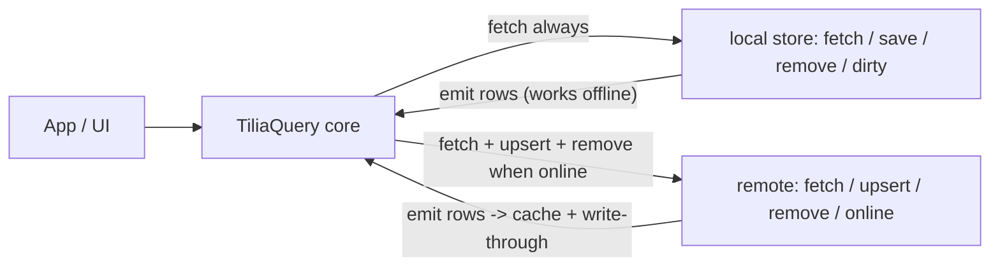

# @tilia/query

Offline-first query and cache layer for [Tilia](https://tiliajs.com) apps.

`@tilia/query` keeps a reactive in-memory view of your collections, backed by
two pluggable tiers: a **local store** (e.g. IndexedDB/Dexie) that answers
every query — even offline — and a **remote** (e.g. REST, Supabase, websocket)
that is the source of truth when the network is available. Writes and deletes
are optimistic, saved locally as a durable outbox, and replayed automatically
on reconnect — including after an app restart.

> Status: `0.1.0`, API stabilizing. The source contract lives in
> [`src/TiliaQuery.resi`](src/TiliaQuery.resi) (ReScript) and
> [`src/index.d.ts`](src/index.d.ts) (TypeScript).

## What it does

- shared object cache by id, query results as ids (normalized, consistent across views)
- `loading` / `loaded` / `notFound` states per query, plus `one()` for detail views
- offline-first reads: local store answers immediately, remote refreshes when online
- optimistic writes **and deletes** with a durable dirty outbox and automatic replay on reconnect
- boot replay: unsynced writes from a previous session resume syncing
- reactive sync status: pending writes count, rejected writes, last fetch error
- stale refresh in the background without clearing current data
- idle-query garbage collection driven by real reactivity (who is watching what)
- object-driven membership: a changed object enters and leaves query results in place, without refetching
- sorted, stable query results: views only change when membership changes
- lifecycle control: `dispose()` and `clear()` for logout / user switch

## What it does not do

- transport (HTTP, websocket, auth) — you provide a `remote` adapter
- storage (IndexedDB schemas, query glue) — you provide a `local` store adapter
- scheduling — you call `tick()` from your own timer
- domain APIs — wrap it with feature-shaped helpers

## How it works



Every query runs against the local store first (instant, works offline). When
online, the same query also runs against the remote; remote rows are written
through to the local store and refresh the query's freshness. Rows with a
pending write keep their optimistic value until the write settles; rows with a
pending delete are dropped so a fetch cannot resurrect them.

## Quick start (TypeScript)

```typescript
import { make } from "@tilia/query";

type Todo = { id: string; title: string; done: boolean };
type TodoQuery = { done: boolean };

const todos = make<Todo, TodoQuery>({
  id: (todo) => todo.id,
  remote, // remote adapter (see below)
  local, // local store adapter (optional)
  // Membership: writes move objects between query results without refetching.
  matches: (query, todo) => query.done === todo.done,
  // Order: id-lists stay sorted and stable across refetches.
  sort: (a, b) => a.title.localeCompare(b.title),
});

// Read (reactive, safe to call in render / observe / watch)
const list = todos.array({ done: false });
if (list === "loading") renderSpinner();
else if (list === "notFound") renderEmpty();
else renderList(list.data);

// Detail view (loads like any query, resolves the first row)
const detail = todos.one({ done: false });

// Write: optimistic, saved dirty locally, pushed when online
todos.upsert({ id: "t1", title: "Ship it", done: false });

// Delete: optimistic, tombstoned locally, pushed when online
todos.remove({ id: "t1", title: "Ship it", done: false });

// Inbound updates (websocket / delta sync): cache + membership, no remote push
todos.sync(changedTodo);

// Sync status for the UI (reactive tilia object)
todos.status.pending; // writes waiting to sync
todos.status.rejected; // writes refused by the server, until todos.dismiss()
todos.status.error; // last remote fetch failure

// Call on your own schedule: stale refresh + garbage collection
todos.tick();

// Logout / user switch
todos.clear(); // empty memory + outbox (local database wipe is your adapter's job)
todos.dispose(); // stop watching connectivity, cancel open channels
```

The same API is available in ReScript; `array()` returns a `loadable` variant
to pattern match on:

```rescript
switch todos.array({done: false}) {
| Loading => renderSpinner()
| Loaded({data}) => renderList(data)
| NotFound => renderEmpty()
}
```

Note: array queries never resolve to `notFound` — an empty result is
`{ state: "loaded", data: [] }`. Only `one()` and `get()` use `notFound`.

## The adapter contracts

Both read paths speak through the same fetch channel. A channel can emit
several times (cached rows now, fresh rows later, live updates forever) and
becomes inert once cancelled — late callbacks are ignored by the core. All
outcomes are named callbacks: adapters never build tagged values.

```typescript
type FetchChannel<T> = {
  readonly state: "live" | "cancelled";
  emit(rows: T[]): void; // push rows
  fail(message: string): void; // transport error: retried on next stale window
  covered(): void; // delta-sync engine owns this query: mark fresh
};

type WriteChannel<T> = {
  readonly state: "live" | "cancelled";
  emit(saved: T): void; // saved: settle clean
  offline(): void; // transient: keep queued and dirty for next reconnect
  conflict(server: T): void; // server wins: server value replaces the write
  reject(message: string): void; // permanent: drop write, surface on status
};
```

### Remote (REST CRUD example)

`remote` must be a tilia object so the core can watch `online` reactively
(reconnect triggers query refresh and outbox replay); `make` throws if it is
not. `fetch` may return a cleanup for live subscriptions. `upsert` and `remove` are push-and-forget:
respond through the channel.

```typescript
import { computed, tilia } from "tilia";

const network = tilia({ online: navigator.onLine });
window.addEventListener("online", () => (network.online = true));
window.addEventListener("offline", () => (network.online = false));

// Maps an HTTP error to the right channel callback.
function settle<T>(channel: WriteChannel<T>, res: Response) {
  if (res.status === 409) res.json().then((server) => channel.conflict(server));
  else if (res.status >= 400 && res.status < 500) channel.reject(res.statusText);
  else channel.offline(); // 5xx / network: retry on next reconnect
}

const remote = tilia({
  online: computed(() => network.online),
  fetch(filter: TodoQuery, channel: FetchChannel<Todo>) {
    fetch(`/api/todos?${new URLSearchParams(filter as any)}`)
      .then((res) => res.json())
      .then(
        (rows) => channel.emit(rows),
        (e) => channel.fail(String(e))
      );
  },
  upsert(todo: Todo, channel: WriteChannel<Todo>) {
    fetch(`/api/todos/${todo.id}`, { method: "PUT", body: JSON.stringify(todo) }).then(
      (res) => (res.ok ? res.json().then((saved) => channel.emit(saved)) : settle(channel, res)),
      () => channel.offline()
    );
  },
  remove(todo: Todo, channel: WriteChannel<Todo>) {
    fetch(`/api/todos/${todo.id}`, { method: "DELETE" }).then(
      (res) => (res.ok ? channel.emit(todo) : settle(channel, res)),
      () => channel.offline()
    );
  },
});
```

### Local store (Dexie example)

The local store doubles as the optimistic read source and the durable outbox.
The recommended storage is in-row flags: indexed `dirty` and `deleted` columns
on the collection table. `fetch` must exclude tombstones (`deleted`), and
`dirty()` returns the outbox as `{ value, deleted }` records.

```typescript
// db.version(1).stores({ todos: "id, done, dirty" });

const local: Store<Todo, TodoQuery> = {
  fetch(filter, channel) {
    db.todos
      .where("done")
      .equals(filter.done ? 1 : 0)
      .and((row) => !row.deleted)
      .toArray()
      .then((rows) => channel.emit(rows.map(strip)));
  },
  save(todo, dirty) {
    db.todos.put({ ...todo, dirty: dirty ? 1 : 0, deleted: 0 });
  },
  remove(todo, dirty) {
    if (dirty) db.todos.put({ ...todo, dirty: 1, deleted: 1 }); // tombstone
    else db.todos.delete(todo.id); // confirmed: purge row + tombstone
  },
  dirty: () =>
    db.todos
      .where("dirty")
      .equals(1)
      .toArray()
      .then((rows) => rows.map((row) => ({ value: strip(row), deleted: !!row.deleted }))),
};

// Remove the storage flags before rows enter the cache.
const strip = ({ dirty, deleted, ...todo }) => todo;
```

`local.fetch` has the exact shape of `remote.fetch`: every query your app
generates must be answerable by both sides, so implement the query glue twice
(e.g. Dexie where-clauses and SQL filters) or share a query parser.

Without `local`, the core is purely in-memory and queries wait for the remote.

**Ordering assumption**: a one-shot `local.fetch` should resolve before the
remote answer (IndexedDB is almost always faster than the network). If your
local fetch can emit after the remote emit, use a live query (Dexie
`liveQuery`) — remote rows are written through to the local store, so live
local reads converge naturally.

## Write lifecycle

`upsert(item)` updates the cache immediately, saves the row dirty in the local
store (even offline — this is what makes writes durable), updates query
membership through `matches` (the id enters matching results and leaves
results that no longer match — no refetch), and pushes to the remote when
online. `remove(item)` follows the same path with a delete tombstone. Latest
write wins per id.

| Remote response | Put entry | Delete entry |
| --- | --- | --- |
| `emit(saved)` | removed, saved clean | removed, row + tombstone purged |
| `conflict(server)` | removed, server value wins, saved clean | removed, server row resurrected, saved clean |
| `reject(message)` | removed, surfaced on `status.rejected`, queries refetch server truth | same, tombstone cleared |
| `offline()` | kept for next reconnect, stays dirty | kept, tombstone stays dirty |

At startup, `make` loads `local.dirty()` and queues each entry through the
same flow, so closing the app mid-sync loses nothing.

## Scheduling

The library never starts timers. Call `tick()` whenever you like (e.g. every
few seconds, on focus, on navigation):

- watched queries older than `stale` seconds refresh in the background (only while online)
- queries nobody watches for `gc` seconds are evicted, along with objects no other query references

## Going further

- [docs/vision.md](docs/vision.md) — why this exists and where it is going
- [docs/technical.md](docs/technical.md) — contracts, data flow, delta-sync compatibility, adapter guidance
- [llms.txt](llms.txt) — entry point for AI coding assistants
- [tiliajs.com](https://tiliajs.com) — Tilia documentation

## License

MIT
