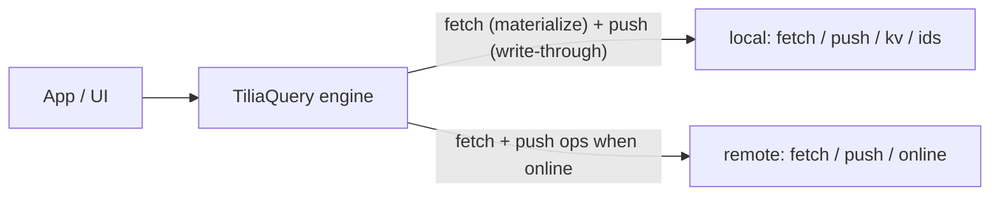

# @tilia/query

Offline-first query and cache layer for [Tilia](https://tiliajs.dev) apps.

`@tilia/query` keeps a reactive in-memory view of your collections, backed by
two pluggable tiers: a **local store** (e.g. IndexedDB/Dexie) that answers
queries even offline, and a **remote** (REST, Supabase, websocket) that is the
authoritative source when the network is available. Writes and removes are
optimistic, queued in a durable outbox, and replayed automatically on
reconnect — including after an app restart.

> Status: `0.1.0`, API stabilizing. The source contract lives in
> [`src/TiliaQuery.resi`](src/TiliaQuery.resi) (ReScript) and
> [`src/index.d.ts`](src/index.d.ts) (TypeScript). The engine model —
> freshness, live queries, outbox, rejections, local purge — is described in
> [TECHNICAL.md](TECHNICAL.md).

## What it does

- shared object cache by id, query results as ids (normalized: one row can
  belong to several queries without duplication)
- reactive read states per query: `loading`, `loaded` (with a `fresh` flag),
  `notFound`, `notLocal`, `failed` — fetch errors surface at the read site,
  there is no global error slot
- offline-first reads: the local store materializes a query instantly, the
  remote result replaces it when online
- optimistic writes and removes: applied to memory and local storage first,
  queued as ops in a durable, ordered outbox
- batch push with per-op confirmation; transient failures stay queued,
  definitive failures revert to remote truth and become rejection contexts
  that the app resolves and `dismiss`es
- boot replay: the persisted outbox reloads and pushes, so closing the app
  mid-sync loses nothing
- live queries: an adaptor that keeps a result fresh on its own (server
  subscription) is exempt from periodic refresh; the engine owns running its
  teardown
- inbound server pushes: `receive.changed` / `receive.removed` update memory,
  membership, and local storage, reconciling any pending local change
- membership by predicate: a written or delivered value joins and leaves
  in-memory query results in place, without refetching
- bounded local retention: a mark-and-sweep purge removes rows no retained
  query record references (unsynced writes always survive)
- lifecycle: a `tick` heartbeat (the engine owns no timers) and `dispose`

## What it does not do

- transport (HTTP, websocket, auth) — you provide a `remote` adaptor
- storage (IndexedDB schemas, query glue) — you provide a `local` adaptor
- scheduling — you call `tick()` from your own timer
- domain APIs — wrap it with feature-shaped helpers

## How it works



The first read of a query fetches the local store (instant, works offline)
and, in parallel, the remote. The local answer only materializes the query:
once a remote result has landed, a late local answer is ignored. Remote
deliveries are reconciled with pending ops — an optimistic edit either merges
or becomes a rejection instead of flickering out — then written through to
the local store, and the query's id-list is persisted as a **query record**.
Records are the retention truth: a periodic mark-and-sweep purge removes local
rows no record (and no queued op) references anymore.

## Read states

`one(query)` and `array(query)` return a loadable. In JavaScript the states
without data are plain strings, the others tagged objects:

- `"loading"` — no answer yet
- `{ state: "loaded", data, fresh }` — `fresh` is `true` while the remote is
  known to be current, `false` when the data is served from the local cache
  or the last remote delivery has expired
- `"notFound"` — `one()` resolved on an empty result (`array()` never
  resolves here: an empty array is loaded)
- `"notLocal"` — the offline dead end: nothing cached locally and the remote
  unreachable. An answer, not a progress state — show "not available
  offline", not a spinner
- `{ state: "failed", message }` — the remote fetch failed; shown at the read
  site and retried once per refresh window

## Quick start (TypeScript)

```typescript
import { make } from "@tilia/query";
import { signal } from "tilia";

type Todo = { id: string; title: string; done: boolean };
type TodoQuery = { done: boolean };

const todos = make<Todo, TodoQuery>({
  id: (todo) => todo.id,
  // Membership: a written or delivered value joins and leaves results in place.
  matches: (query, todo) => query.done === todo.done,
  remote, // remote adaptor (see below)
  local, // local adaptor (optional, see below)
});

// Read (reactive: call in render / observe / watch)
const list = todos.array({ done: false });
if (list === "loading") renderSpinner();
else if (list === "notLocal") renderOffline();
else if (list === "notFound") renderEmpty(); // one() only, arrays load empty
else if (list.state === "failed") renderError(list.message);
else renderList(list.data, list.fresh);

// Detail view: first result per sort. Model read-by-id as a query.
const detail = todos.one({ done: true });

// Write: optimistic, durable, pushed when online
todos.upsert({ id: "t1", title: "Ship it", done: false });

// Remove by id: optimistic, queued like any write
todos.remove("t1");

// Inbound pushes from a server subscription: facts, not commands
todos.receive.changed([changedTodo]);
todos.receive.removed(["t2"]);

// Sync status (reactive tilia object)
todos.status.pending; // ops waiting in the outbox
todos.status.rejected; // reverted conflicts and definitive failures

// Remote truth is already visible. Resolve or ignore the context, then:
todos.dismiss(rejection);

// Heartbeat: refresh, expiry, gc and push retries all happen here
setInterval(() => todos.tick(), 10_000); // anything ≤ expiry.refresh / 2

// Shutdown: stop watching connectivity, close every open fetch
todos.dispose();
```

The same API in ReScript pattern matches on the `loadable` variant:

```rescript
switch todos.array({done: false}) {
| Loading => renderSpinner()
| Loaded({data, fresh}) => renderList(data, ~fresh)
| NotLocal => renderOffline()
| Failed({message}) => renderError(message)
| NotFound => renderEmpty() // array queries never resolve here
}
```

### Configuration

`make` takes a configuration object:

```typescript
make({ id, matches, remote, local?, expiry?, now?, key?, sort?, merge? })
```

- `expiry` — timing tiers in milliseconds, defaults
  `{ refresh: 30_000, memory: 300_000, local: 2_592_000_000 }` (30 s, 5 min,
  30 days). Memory is a small RAM cache of observed queries; local is the
  durable superset on disk.
- `key` — query to cache key; defaults to `sortedStringify` (deterministic
  JSON with sorted keys), so equivalent object filters map to the same query.
- `sort` — returns a result sorter for the query
  (e.g. `(query) => (rows) => rows.toSorted(byTitle)`). It runs inside a
  computed, so an edit to a sort key reorders the list reactively.
- `merge` — receives the local `Change` and remote value. Mutate the local
  value in place and return `true` when they reconcile; return `false` to show
  remote truth and record a conflict.

## The adaptor contracts

**Query shape**: queries must be plain data (they survive a JSON round trip:
the default `key` and the persisted query registry both assume it) and pure
per-row predicates. `matches(query, value)` decides membership by looking at
one row, and a fetch answers with the query's full result set. Limits,
pagination and aggregates do not fit this shape — a written row joins a
result through `matches` alone, and a full-result `set` replaces whatever a
partial window would try to keep.

Both tiers must be able to answer every `'query` value your app generates
(e.g. Dexie where-clauses and REST params): implement the interpretation
twice or share a query parser.

### Remote

```typescript
type Remote<T, Q> = {
  online: Signal<boolean>; // connectivity, owned by the app
  fetch(query: Q, channel: ReadChannel<T>): void;
  push(ops: Op<T>[], channel: WriteChannel<T>): void;
};

type ReadChannel<T> = {
  set(values: T[]): void; // full result set; call again when fresher rows arrive
  live(values: T[]): void; // same, and: "I keep this fresh" — periodic refresh skips the query
  fail(message: string): void; // failed result; does not close the fetch
  end(): void; // the stream is over: teardown runs, back to periodic refresh
  finally(fn: () => void): void; // register the teardown; single slot, runs exactly once
};

type WriteChannel<T> = {
  set(value: T): void; // confirm one upsert with the authoritative value
  removed(id: string): void; // confirm one remove, by id
  retry(): void; // transient: unconfirmed ops stay pending for a later push
  fail(message: string): void; // definitive: revert unconfirmed ops and record rejections
};
```

`online` is a tilia signal the app owns: set its value as connectivity
changes. Flipping to `true` replays the outbox; flipping to `false` settles
queries still loading to `notLocal`.

The engine closes a fetch on `end`, when a newer fetch supersedes it, when
the query is evicted from memory, and on `dispose`. Every callback on a
closed fetch is a noop — adaptors never need to guard against late replies.
Registering `finally` on an already closed fetch runs the teardown
immediately.

A REST remote:

```typescript
import { signal } from "tilia";

const [online, setOnline] = signal(navigator.onLine);
window.addEventListener("online", () => setOnline(true));
window.addEventListener("offline", () => setOnline(false));

const remote: Remote<Todo, TodoQuery> = {
  online,
  fetch(query, channel) {
    fetch(`/api/todos?done=${query.done}`)
      .then((res) => res.json())
      .then(
        (rows) => channel.set(rows),
        (e) => channel.fail(String(e))
      );
  },
  async push(ops, channel) {
    try {
      for (const op of ops) {
        if (op.op === "upsert") {
          const res = await fetch(`/api/todos/${op.value.id}`, {
            method: "PUT",
            body: JSON.stringify(op.value),
          });
          if (res.status >= 400 && res.status < 500) return channel.fail(res.statusText);
          if (!res.ok) return channel.retry();
          channel.set(await res.json()); // server-corrected value wins
        } else {
          const res = await fetch(`/api/todos/${op.id}`, { method: "DELETE" });
          if (res.status >= 400 && res.status < 500) return channel.fail(res.statusText);
          if (!res.ok) return channel.retry();
          channel.removed(op.id);
        }
      }
    } catch {
      channel.retry(); // network error: unconfirmed ops stay pending
    }
  },
};
```

A live subscription answers through `live` and hands its teardown to the
engine:

```typescript
fetch(query, channel) {
  const sub = socket.subscribe(query, (rows) => channel.live(rows));
  sub.onClose(() => channel.end()); // source shut down: back to periodic refresh
  channel.finally(() => sub.unsubscribe());
},
```

Going offline does not end a live query — the engine cannot know whether the
transport survived, so ending is the adaptor's call.

### Local

The local adaptor is command-only: confirmation, retry and rejection are
remote concepts. A local storage error is the adaptor's own business (log,
retry, surface in app state) — the engine never sees it.

```typescript
type Local<T, Q> = {
  // Fetch cached results; `unknown` when the storage cannot answer the query.
  fetch(query: Q, channel: { set(values: T[]): void; unknown(): void }): void;
  // Apply value changes in order: upsert writes or replaces the row, remove drops it.
  push(ops: Op<T>[]): void;
  // String KV for engine bookkeeping (outbox, query registry); undefined deletes.
  set(tag: string, key: string, value: string | undefined): void;
  // One entry by key, or every entry for the tag when key is undefined.
  get(tag: string, key: string | undefined, set: (values: string[]) => void): void;
  // Every row id in the values table (the purge's sweep phase).
  ids(set: (ids: string[]) => void): void;
};
```

Values reach the adaptor typed, so it stores them natively and can index them
for `fetch`. There are no dirty flags or tombstones to manage: the values
table always holds the current optimistic state, and the engine keeps the
outbox and the query registry in the KV. A Dexie sketch:

```typescript
// db.version(1).stores({ todos: "id, done", kv: "k" });

const local: Local<Todo, TodoQuery> = {
  fetch(query, channel) {
    db.todos
      .where("done")
      .equals(query.done ? 1 : 0)
      .toArray()
      .then((rows) => channel.set(rows));
  },
  push(ops) {
    for (const op of ops) {
      if (op.op === "upsert") db.todos.put(op.value);
      else db.todos.delete(op.id);
    }
  },
  set(tag, key, value) {
    if (value === undefined) db.kv.delete(`${tag}:${key}`);
    else db.kv.put({ k: `${tag}:${key}`, v: value });
  },
  get(tag, key, set) {
    if (key !== undefined) db.kv.get(`${tag}:${key}`).then((row) => set(row ? [row.v] : []));
    else
      db.kv
        .where("k")
        .startsWith(`${tag}:`)
        .toArray()
        .then((rows) => set(rows.map((r) => r.v)));
  },
  ids(set) {
    db.todos.toCollection().primaryKeys().then((keys) => set(keys as string[]));
  },
};
```

Without `local`, the engine is purely in-memory: queries wait for the remote,
and a query opened offline resolves to `notLocal`.

## Write lifecycle

`upsert(value)` updates the memory cache, joins and leaves in-memory query
results through `matches` (a move updates both queries at once — no refetch),
writes the value to the local store, and enqueues an `Upsert` op. `remove(id)`
takes the id out of every in-memory result and loaded query record, deletes
the local row, and enqueues a `Remove` op. Ops are persisted in the local KV,
so pending writes survive a restart.

While online, one push carries every pending op not already in flight, in
order. Settlement per the write channel:

- `set(value)` — the op leaves the outbox; the authoritative value replaces
  or merges into memory and the local row
- `removed(id)` — the op leaves the outbox
- `retry()` — unconfirmed ops stay pending; pushed again on a later `tick` or
  reconnect
- `fail(message)` — unconfirmed ops leave the outbox, their optimistic changes
  revert to remote truth, and contexts enter `status.rejected`, keyed by id
  (a newer rejection replaces an older one for the same id)

A rejection is context, not an operation or overlay. The failed op and its
persisted outbox entry are already gone. Keeping the local version is an
ordinary `upsert`; keeping remote truth needs no data change. In either case,
call `dismiss(rejection)` after the application has resolved or ignored the
context. Rejection contexts are not persisted across restarts.

## Scheduling

The engine owns no timers: refresh, expiry, gc and push retries happen only
inside `tick()` (and on `remote.online` transitions). Call it on an interval;
anything ≤ `expiry.refresh / 2` is fine.

On each tick:

- observed remote-loaded queries past `expiry.refresh` refetch in the
  background (only while online; live queries are excluded — their source
  keeps them fresh)
- a remote result with no delivery within the refresh window flips to
  `fresh: false` without losing its data
- queries nobody observes for `expiry.memory` are evicted from RAM — an
  unobserved live subscription is torn down here — along with objects no
  remaining query references; the data stays in the local store and reopening
  the query re-materializes it
- the local purge (first tick after boot, then at most once per
  `expiry.local / 8`) mark-and-sweeps rows no retained query record lists;
  pending ops always root their rows

## Scale

The engine bets on linear scans instead of indexes: a write offers the value
to every in-memory query, and every remote delivery re-applies the whole
pending outbox overlay. This is deliberate at client-cache scale — dozens of active
queries and an outbox that drains on reconnect. See
[the linear-scan bet](TECHNICAL.md#the-linear-scan-bet) in TECHNICAL.md for
where the bet holds and where it would break.

## Going further

- [TECHNICAL.md](TECHNICAL.md) — the engine model: freshness, live queries,
  outbox and rejections, local purge, the linear-scan bet
- [docs/vision.md](docs/vision.md) — why this exists and where it is going
- [llms.txt](llms.txt) — compact guide and exact-contract pointers for coding assistants
- [tiliajs.dev/query](https://tiliajs.dev/query) — published @tilia/query documentation

Debug hook: `_canopy()` lists observed vs idle query keys.

## License

MIT
