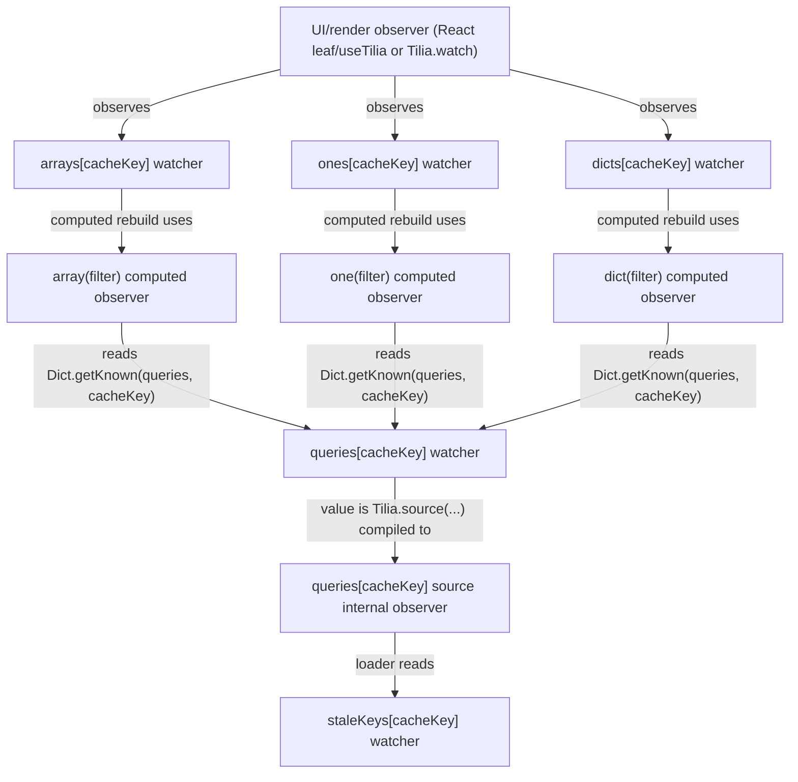
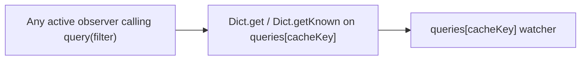

# `queries` Dict read/write audit (observe-context exactness)

Plan checked: `/Users/anna/.cursor/plans/fix_stuck_live_queries_08b8113a.plan.md`

Scope: exact direct access points to `queries` in `query/src/TiliaQuery.res`, with tracking context derived from `tilia/src/Tilia.res`.

## Observe semantics used for classification

- A property read is tracked only when `root.observer` is set (`tilia/src/Tilia.res`, `get` trap).
- `Dict.keys(proxy)` goes through `ownKeys` and tracks the synthetic `indexKey` when `root.observer` is set.
- `_canopy(proxy)` inspects proxy metadata directly (`meta.target` and `meta.observed`), so it does not subscribe an observer.
- `computed(() => ...)` rebuild runs with its own internal observer set, so reads inside that callback are tracked by that computed observer.

## Basic read/write points for `queries` (including non-claims-app observe context)

| Line | Access | Location | Expression | Kind | Observe context / effect |
|---|---|---|---|---|---|
| [419](../src/TiliaQuery.res#L419) | Write | `commit(cacheKey, m, ids)` | `Dict.set(queries, cacheKey, Loaded({data: ids}))` | Set existing/new key | Normal mutation path; notifies key if observed and `indexKey` when introducing a new key |
| [582](../src/TiliaQuery.res#L582) | Read | `replay()` | `Tilia._canopy(queries)` | Canopy metadata read | `_canopy` introspection only; non-subscribing |
| [588](../src/TiliaQuery.res#L588) | Read | `disconnect()` | `Tilia._canopy(queries)` | Canopy metadata read | `_canopy` introspection only; non-subscribing |
| [624](../src/TiliaQuery.res#L624) | Read | `query(filter)` | `Dict.get(queries, cacheKey)` | Key read | Caller-dependent; tracked only when caller already has active observer |
| [630](../src/TiliaQuery.res#L630) | Write | `query(filter)` miss path | `Dict.set(queries, cacheKey, s)` | Set new key | New entry creation; notifies key and structure/index watchers |
| [631](../src/TiliaQuery.res#L631) | Read | `query(filter)` | `Dict.getKnown(queries, cacheKey)` | Key read | Caller-dependent; tracked only when caller already has active observer |
| [648](../src/TiliaQuery.res#L648) | Read | `one(filter)` computed body | `Dict.getKnown(queries, cacheKey)` | Key read | Inside `Tilia.computed` (`one`) rebuild; always tracked by computed internal observer |
| [676](../src/TiliaQuery.res#L676) | Read | `array(filter)` computed body | `Dict.getKnown(queries, cacheKey)` | Key read | Inside `Tilia.computed` (`array`) rebuild; always tracked by computed internal observer |
| [703](../src/TiliaQuery.res#L703) | Read | `dict(filter)` computed body | `Dict.getKnown(queries, cacheKey)` | Key read | Inside `Tilia.computed` (`dict`) rebuild; always tracked by computed internal observer |
| [729](../src/TiliaQuery.res#L729) | Read | `tick()` | `Tilia._canopy(queries)` | Canopy metadata read | `_canopy` introspection only; non-subscribing |
| [752](../src/TiliaQuery.res#L752) | Write | `tick()` GC path | `Dict.delete(queries, k)` | Delete key | GC mutation; notifies key and structure/index watchers |
| [764](../src/TiliaQuery.res#L764) | Read | `tick()` | `Dict.keys(queries)` | Keys read (`ownKeys`) | Caller-dependent; tracks synthetic `indexKey` only when caller has active observer |
| [765](../src/TiliaQuery.res#L765) | Read | `tick()` | `Dict.getKnown(queries, k)` | Per-key read | Caller-dependent; tracked only when caller already has active observer |
| [779](../src/TiliaQuery.res#L779) | Read | `canopy()` | `Tilia._canopy(queries)` | Canopy metadata read | `_canopy` introspection only; non-subscribing |
| [805](../src/TiliaQuery.res#L805) | Read | `clear()` | `Dict.keys(queries)` | Keys read (`ownKeys`) | Caller-dependent; tracks synthetic `indexKey` only when caller has active observer |
| [805](../src/TiliaQuery.res#L805) | Write | `clear()` | `Dict.keys(queries)->Array.forEach(k => Dict.delete(queries, k))` | Delete all keys | Clear-all mutation; repeated delete notifications per key and structure/index |

## Validated observer tracking in `claims-app-ts`

| claims-app-ts line | Site | Expression | Validated tracking path to `queries` |
|---|---|---|---|
| [11](../../claims-app-ts/src/app/features/claims/index.ts#L11) | `claimsBranch` | `list: derived(list(repo, user))` | Declares `claims.list` as derived reactive value consumed by UI observers |
| [18](../../claims-app-ts/src/app/features/claims/computed.ts#L18) | `list(repo, user)` | `repo.claims.array(query(self.tab, user))` | Enters `query` array path that reaches `queries` reads at [624](../src/TiliaQuery.res#L624), [631](../src/TiliaQuery.res#L631), and [676](../src/TiliaQuery.res#L676) |
| [146](../../claims-app-ts/src/ui/UserPane.tsx#L146) | `List` component | `const List = leaf(...)` | `leaf` sets render-time observer scope for reads inside `List` |
| [147](../../claims-app-ts/src/ui/UserPane.tsx#L147) | `List` component body | `const list = claims.list` | Observed UI read that keeps the active `claims.list` query key live while mounted |

Action note: [tab click handler](../../claims-app-ts/src/ui/UserPane.tsx#L68) (`onClick={() => claims.filter(tab)}`) is a trigger only, not an observed read site.

## Intentional non-read inside loader tracked scope

- In `startFetch.receive`, line 532 comment documents why it avoids reading `queries` there: doing so inside source loader tracked scope would subscribe the loader to its own result.
- Instead, it reads `meta.ids` and writes through the source `set(...)`, avoiding a self-observation cycle on `queries`.

## Observer graph: observers and their observers

### Direct `query(filter)` observer path (without view computed)

Notes:
- `query(filter)` reads are tracked only when the caller is already in observe context.
- `one/array/dict` computed reads are the stable, always-tracked subscriptions to `queries[cacheKey]`.
